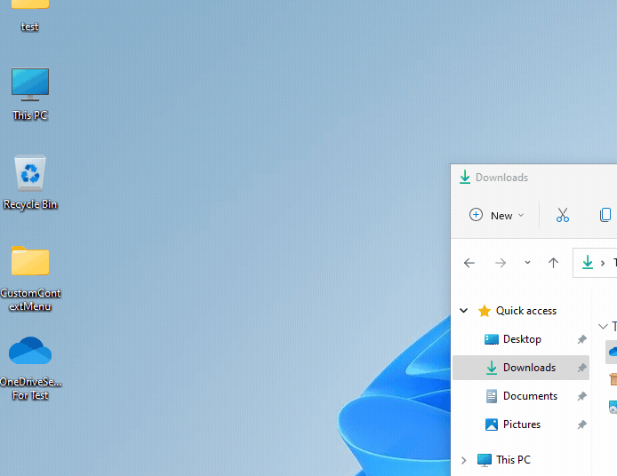

# Quickstart

Welcome to the **ZeroX Quick Start Guide!** This guide is designed for Flutter developers who are eager to quickly integrate Flutter packages into their projects with ease. In this tutorial, you will learn how to use ZeroX to seamlessly add packages, generate code, and ensure everything is set up perfectly with just one click.

### Video Overview

Watch this video to see how easily ZeroX lets you integrate any package into your Flutter project with just one click.

<iframe style={{ position : 'absolute', top : '0', left : '0', width : '100%', height : '100%' }} width="560" height="315" src="https://www.youtube-nocookie.com/embed/F7WKovEFdnw" title="YouTube video player" frameborder="0" allow="accelerometer; autoplay; clipboard-write; encrypted-media; gyroscope; picture-in-picture" allowfullscreen></iframe>

---

# How to Use ZeroX

After installing ZeroX on your system, follow these steps to get started:

1. **Create an Account:** 
Getting started is simple and flexible, with three convenient ways to create your account:  

    - **Email Sign-Up:** Create an account using your email address by entering your details and setting up a secure password.  

    - **Google Sign-In:** Log in quickly using your Google account for a seamless and password-free experience. 

    - **Apple Sign-In:** Sign in securely and privately using your Apple ID for a streamlined experience.  

    Choose the option that works best for you and start exploring ZeroX effortlessly!

    

2. **Search for a Flutter Package:** 

    - After successfully signing up, you’ll be redirected to the landing page, which serves as your central hub for exploring and managing Flutter packages. At the top of the page, you’ll find a powerful search feature designed to help you quickly locate the specific Flutter package you need for your project.

    - Simply type the name of the package or relevant keywords into the search bar. The system will fetch results directly from the [pub.dev](https://pub.dev) website, displaying a comprehensive list that includes: Package Name, Descriptions, and Ratings 

        This ensures you have access to the most reliable and up-to-date information, helping you identify the best match for your project requirements.

    - Once you spot the package you’re looking for, click on it to access a comprehensive set of details. This includes:  

        - **Usage Instructions:** Step-by-step guidance on how to implement the package in your project.  

        - **Platform Compatibility:** Information on which platforms (iOS, Android, web, etc.) the package supports.  

        - **Community Ratings and Reviews:** Insights from other developers to help assess reliability and performance.  

    With all this information at your fingertips, you can confidently proceed to integrate the package into your project and enhance its functionality.

    

3. **Select Your Flutter Project:** After selecting the package, the next step is to choose the specific Flutter project where you want to integrate it. Ensure that the project is open and properly set up, so you can smoothly add the package and start using it in your project.

    

4. **Select Your Device:** Choose the device or platform on which you want to test the package integration. Depending on your project, you can select from various options such as:

    - **Browser**: Test the integration directly in a web environment.
    - **Windows**: Choose this option for testing on a Windows desktop application.
    - **Real Devices**: Select a physical device (iOS or Android) to test the integration on real hardware.
    - **Emulator/Simulator**: Opt for an emulator or simulator if you want to test on a virtual device for faster development and debugging.

    This step ensures that the package is tested in the correct environment, allowing you to verify its functionality and compatibility across different platforms.

    

5. **Check Pre-requirements:** Before implementing the package, you may be asked to provide some pre-requirements. For example, if you choose to implement an **Authentication** package, we will ask for details such as the type of information you want on the Sign-Up and Sign-In pages. These details help ensure the package is properly integrated and tailored to your project’s needs. If there are any other specific requirements for the package, you’ll be prompted to address them before proceeding.

    

6. **Generate the Package:** Once you’ve provided the necessary pre-requirement details, simply click the **Generate** button. From this point onward, ZeroX takes care of everything for you. We’ll add the selected package to your Flutter project by updating the `pubspec.yaml` file, generate the required code using AI, and then integrate it into your project seamlessly.

    After we run the project, you’ll see that the package is already integrated, and everything works as expected—no additional steps required on your end.

    

