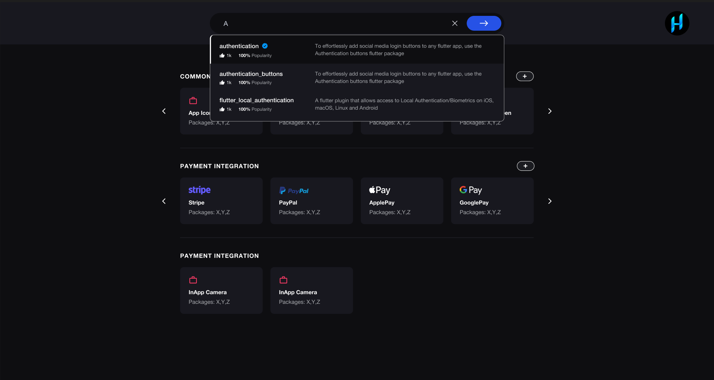
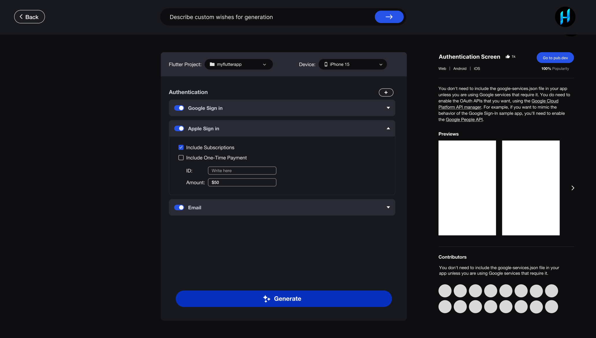
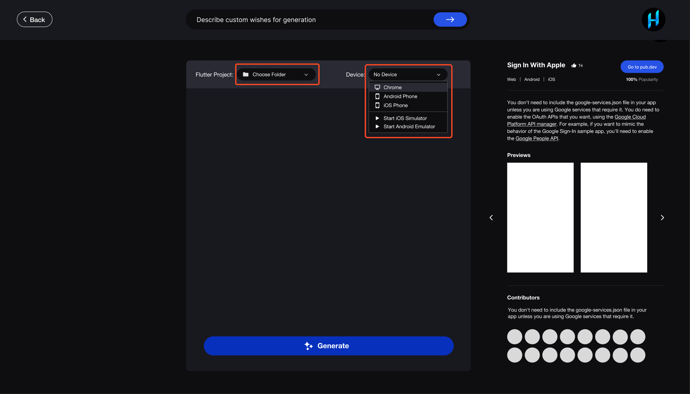
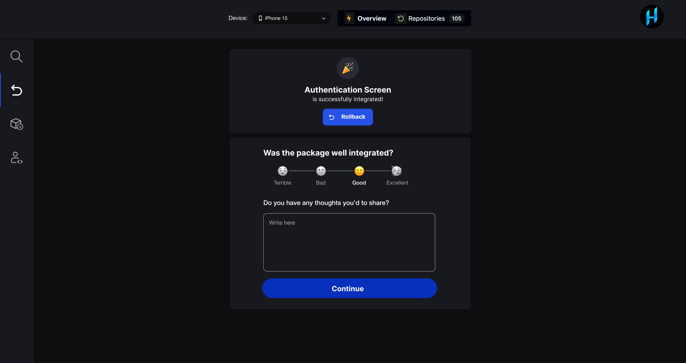

# Integrate Package

### **Launch ZeroX**

Open the ZeroX application and log in using your credentials. Once logged in, you’ll be directed to the **Dashboard**.

----------

### **Search for a Package**

1.  Navigate to the **Search Bar** at the top of the Dashboard.
2.  Enter the package name or relevant keywords.
3.  Review the search results, which display:
    -   **Package Name**
    -   **Description**
    -   **Community Ratings and Reviews**
4.  Click on the desired package to view its details.

----------

### **Review Package Details**

Once you’ve selected a package, review the following information:

-   **Usage Instructions**: Step-by-step guide on using the package.
-   **Platform Compatibility**: Supported platforms (iOS, Android, Web, etc.).
-   **Additional Dependencies**: Check for any required dependencies.

----------

### **Select Your Flutter Project**

1. Click the **Select Project** button.
2. Choose the active Flutter project where the package will be integrated.
3. Ensure the project is open and properly configured in your IDE (e.g., VS Code, Android Studio).
4. Select the platform or device for testing the integration:
	-  **iOS/Android Real Devices**
	-  **Emulator/Simulator**

----------

### **Provide Pre-requirements (If Applicable)**

Certain packages may require additional configuration before integration. Example:

-   For an **Authentication Package**, provide details for Sign-Up/Sign-In forms (e.g., fields like email, password).

1.  Enter the requested information in the provided fields.
2.  Click **Next** to proceed.

----------

### **Generate and Integrate the Package**

1.  Click the **Generate** button to begin the integration.
2.  ZeroX will:
    -   Automatically update the `pubspec.yaml` file.
    -   Fetch and install the package from **pub.dev**.
    -   Generate the necessary code using AI.
3.  A confirmation message will appear once the process is complete:  
    _"Package successfully integrated into your project!"_

----------

## Testing the Integration

### **Run the Project**

-   Open your IDE and run the project using the `flutter run` command or through the IDE’s run options.
-   Verify that the package is working as expected in the selected environment.
