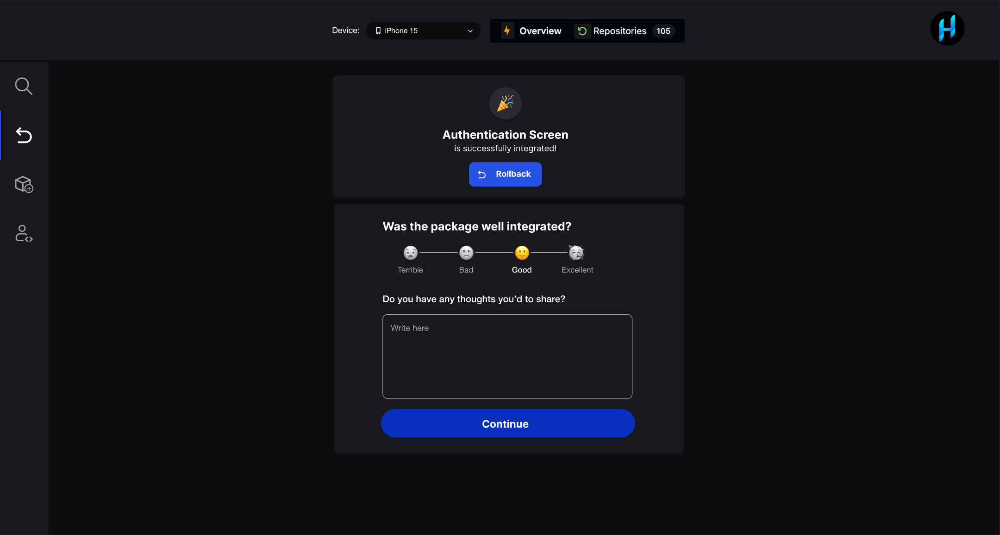
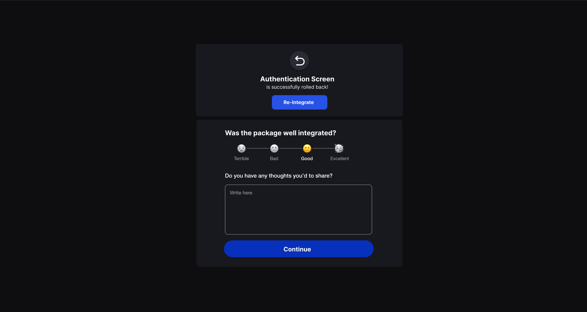
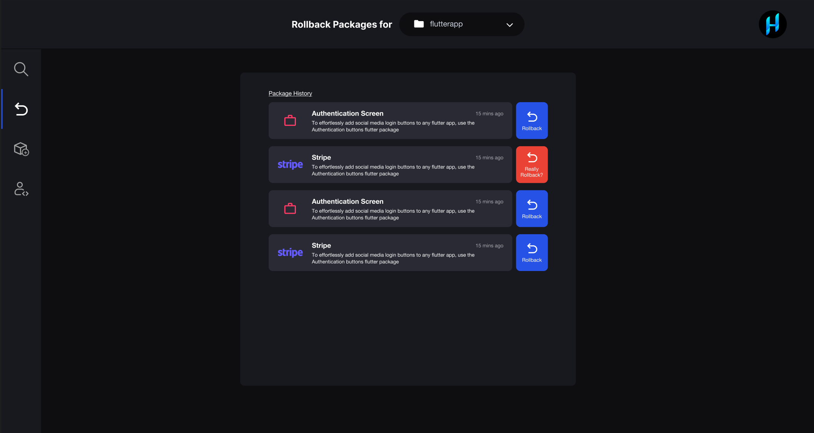

# Rollback Package

If a package causes issues or is incompatible, you can perform a rollback to a previous stable version. This step ensures that your project remains functional while troubleshooting any issues introduced by recent package updates.

### **Immediate Rollback**

When a package is successfully integrated, you can quickly roll it back if needed.

1.  After the package integration completes, locate the **Rollback** button on the **Package Integration Successful** page.
2.  Click the **Rollback** button to revert the changes immediately.

### **Re-Integrate a Rolled-Back Package**

If a rollback requires re-integration of the package:
1.  Click the **Re-Integrate** button on the same page to initiate the process again.
2.  Follow the prompts to complete the re-integration.

### **Rollback from Package History**

To roll back any previous package from the package history:

1.  Navigate to the **Package History** page.
2.  Locate the package you wish to roll back from the **Package History List**.
3.  Select the desired package and click the **Rollback** button to revert to that version.

